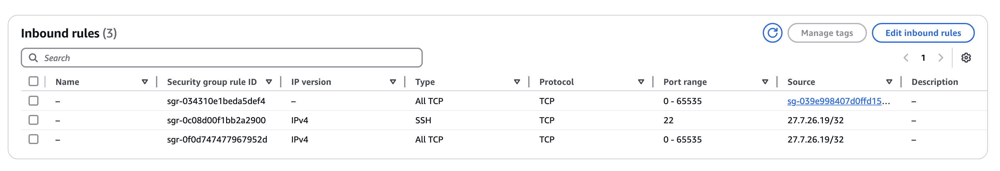

Region: N. Virginia - us-east-1
Name: TW_India_llm_experiment
OS: Ubuntu 
Deep Learning OSS Nvidia Driver AMI GPU PyTorch 2.5 (Ubuntu 22.04)
Instance Type: 
g4dn.xlarge
g6.12xlarge
Key Pair: tw_india_shrijayan
Change to Public Subnet
Network: SSH My IP
Storage: 100
My IP: 14.142.51.155/32


Security Group Edit: 
```
Custom TCP
0-65535
shrijayan-security-group
```


<!-- Initial Setup:
```
sudo apt update
sudo apt install python3.12-dev
sudo apt install -y build-essential libglvnd-dev pkg-config
wget https://developer.download.nvidia.com/compute/cuda/repos/ubuntu2404/x86_64/cuda-keyring_1.1-1_all.deb
sudo dpkg -i cuda-keyring_1.1-1_all.deb
sudo apt update

sudo apt install -y nvidia-driver-570
sudo apt install nvidia-utils-570
sudo apt install -y nvidia-fabricmanager-570
sudo systemctl enable nvidia-fabricmanager
sudo systemctl start nvidia-fabricmanager
sudo apt install nvidia-cuda-toolkit

sudo reboot

nvidia-smi
``` -->

Tmux:
```
sudo apt install tmux
tmux new -s vllm

source vllm/bin/activate
```

Installing Dependencies:
```
sudo apt install python3.12-venv
python3.12 -m venv vllm
source vllm/bin/activate
pip install vllm ray
```

Ray Connect:
```
ray start --head --port=6379
```
Take the ID and paste in other machine to connect to the same ray cluster

```
ray status
```

<!-- Docker Install:
```
sudo apt update
sudo apt install apt-transport-https ca-certificates curl software-properties-common
curl -fsSL https://download.docker.com/linux/ubuntu/gpg | sudo gpg --dearmor -o /usr/share/keyrings/docker-archive-keyring.gpg
echo "deb [arch=$(dpkg --print-architecture) signed-by=/usr/share/keyrings/docker-archive-keyring.gpg] https://download.docker.com/linux/ubuntu $(lsb_release -cs) stable" | sudo tee /etc/apt/sources.list.d/docker.list > /dev/null
sudo apt update
apt-cache policy docker-ce
sudo apt install docker-ce
sudo systemctl status docker
``` -->

# Copy the Private IP and paste in thr prometheus.yml file

Git clone the repository:
```
git clone https://github.com/shrijayan/vLLM-Grafana-Prometheus.git
cd vLLM-Grafana-Prometheus
sudo docker compose up -d
```

Grafana > Connections > Data Sources > Prometheus
```
URL: http://<AWS_URL>:9090
```

Grafana
Copy Paste for dashboard:
```
https://raw.githubusercontent.com/vllm-project/vllm/refs/heads/main/examples/online_serving/prometheus_grafana/grafana.json 
```

<!-- Install Model:
```
sudo apt-get install git-lfs
git lfs install
git clone https://huggingface.co/deepseek-ai/DeepSeek-R1-Distill-Qwen-32B
git clone https://huggingface.co/deepseek-ai/DeepSeek-R1-Distill-Qwen-7B
``` -->

python -m vllm.entrypoints.openai.api_server \
--model /mnt/home/ubuntu/DeepSeek-R1-Distill-Llama-70B \
--served-model-name DeepSeek-R1 \
--enable-reasoning \
--reasoning-parser deepseek_r1 \
--dtype float32 \
--port 8000 \
--gpu_memory-utilization 0.99 \
--tensor-parallel-size 8 \
--pipeline-parallel-size 2


vLLM Serve:
```
python -m vllm.entrypoints.openai.api_server \
--model /home/ubuntu/DeepSeek-R1-Distill-Qwen-7B \
--served-model-name DeepSeek-R1 \
--enable-reasoning \
--reasoning-parser deepseek_r1 \
--dtype float16 \
--port 8000 \
--gpu_memory-utilization 0.98 \
--tensor-parallel-size 8 \
--pipeline-parallel-size 2

```

cURL:
```
curl http://0.0.0.0:8000/v1/chat/completions \
    -H "Content-Type: application/json" \
    -d '{
        "model": "DeepSeek-R1",
        "messages": [{"role": "user", "content": "San Francisco is a"}],
        "temperature": 0
    }'
```


Maybe 


How to download the model?
S3 or image replicate or volume replicate

How to create volume replicate?

How to download the model in low configure machine?
4GB ram not enough 32GB ram mahcine needed

Who to create the EC2 with DeepLearning Image?
Deep Learning AMI (Ubuntu 22.04) Version 42.0

How to two ec2 mahcine in HPC?

Why it is slow when I rent 10 24GB GPU machine?